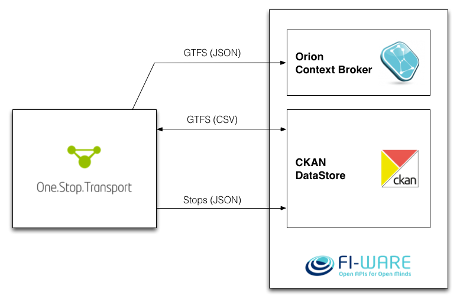

Python connectors between **One.Stop.Transport** and **FI-WARE**, for demonstration purposes of the FIWARE Lisbon Case.

## FI-WARE Lisbon use case

This is an integration project between [One.Stop.Transport](https://ost.pt) and [FI-WARE](http://fi-ware.org), for the demonstration FI-WARE Lisbon Use Case. It is a connector that fetches mobility data (GTFS or bus/train stops) from OST and inserts it on FI-WARE instances, as shown belos: 

This project is composed by two applications: `fiware` and `ckan`. The first aims to insert data into an [Orion Context Broker](http://catalogue.fi-ware.org/enablers/configuration-manager-orion-context-broker) instance while the other (`ckan`) imports it into a CKAN instance, more precisely to its [DataStore extension](http://docs.ckan.org/en/latest/maintaining/datastore.html).

This project is more focused on CKAN, since the Orion Context Broker is more adequate for dynamic or real-time data. The CKAN connector fetches mobility data (either bus/train stops from Lisbon or complete GTFS datasets) from One.Stop.Transport's [APIs](https://developer.ost.pt/api-explorer/) and pushes it to CKAN:

  - If the data is the whole GTFS dataset, the `.txt` files are uploaded to CKAN;
  - If data only consists of bus/train stops, it is uploaded in a specific JSON format, established by the other partners involved.

Read more technical information (setup and usage instructions) **[here](fiware_lisbon)**.

---

## Issues

Having issues or questions? Just leave an [issue on this repository](https://github.com/OneStopTransport/Orion-Context-Broker-Exporter/issues) and we'll see what we can do to help you out!

